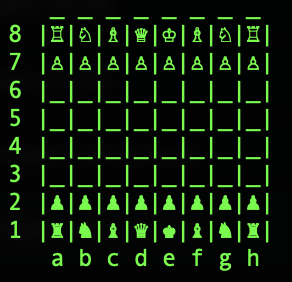

# chess_please
Chess, but awesome :smirk:

A chess engine implementation with an ASCII frontend.



Valid moves are of the form ```[a-hA-H][1-8],[a-hA-H][1-8]``` (for example, ```a2,a4```).

If a player wishes to concede, he can simply type ```concede```. If both players wish to exit, just type ```exit```. 

It's as simple as that!